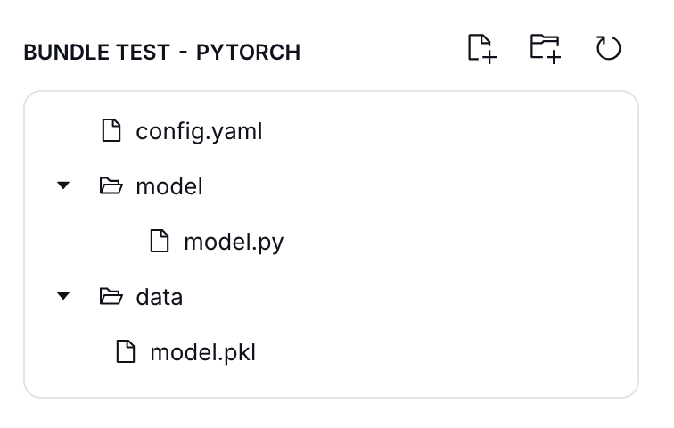

# OpenInnovation Module Bundle Examples

This repository contains examples to get started with the OpenInnovation Model Bundle import.

## Installation

Clone the repository with `git clone https://github.com/openinnovationai/model-bundle-examples`

## Examples

Each folder has a Model Bundle created using a specific library.

To build a bundle for a specific example:
- Move to the example folder
- Install the requirements: `pip install -r requirements.txt`
- Run the `create_bundle.py` script
- Upload on the OpenInnovationAI platform
  - the `config.yaml` configuration file
  - the `model/model.py` model file
  - the `data/` folder with the model weights

